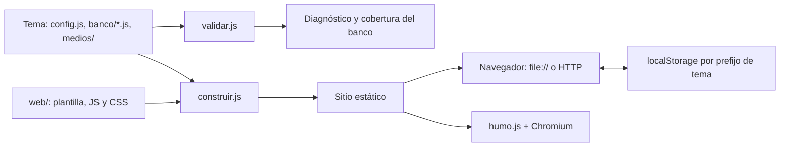
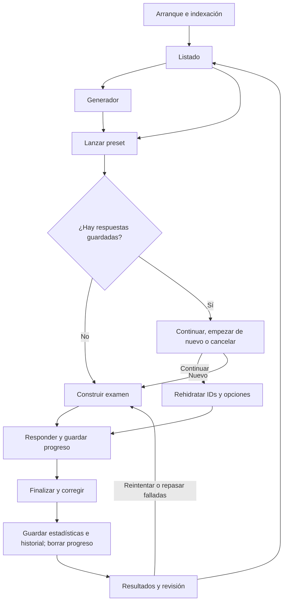

# Arquitectura

Revisada el 19 de septiembre de 2026. [Índice](README.md).

## Alcance y decisiones

quizEngine separa el motor de examen del contenido de cada materia. El repositorio
contiene el motor, las herramientas de ensamblado y un tema de ejemplo; los temas
reales pueden vivir en otros repositorios y consumir una versión del motor.

El producto generado es un directorio estático que se abre mediante `file://` o
se sirve desde un alojamiento estático. No hay backend, autenticación, base de
datos remota, llamadas `fetch`, service worker ni sincronización. Las respuestas
correctas forman parte del JavaScript descargado: el diseño permite estudiar
sin conexión y no oculta las soluciones al usuario del navegador.

Los scripts clásicos y el auto-registro permiten cargar los mismos datos en el
navegador y en Node. Prescindir de framework y bundler mantiene pequeño el motor,
pero hace explícitas las dependencias de orden y el estado global compartido.

## Del tema al sitio

La validación y la construcción son comandos separados. El constructor **no
ejecuta el validador**: comprobar que hay `config.js` y ficheros `.js` en el banco
no garantiza que sus datos sean válidos.

[construir.js](../scripts/construir.js) resuelve las rutas respecto al directorio
de ejecución, enumera solo los `.js` directamente dentro de `banco/` y los ordena
alfabéticamente. Valida que el destino no solape el tema ni la plantilla, prepara
el sitio en una carpeta temporal hermana y lo publica sólo al terminar. Copia
configuración y banco a `tema/`, medios a `medios/` y sustituye el marcador por
etiquetas `script`. No transpila ni minimiza.

## Orden de carga y módulos

[web/index.html](../web/index.html) fija este orden, sin `async` ni `defer`:

1. `tema/config.js` y `tema/banco/*.js`, inyectados por el constructor.
2. `textos.js`, `persistencia.js`, `banco.js`, `examen.js`, `ui.js`.
3. `vista-listado.js`, `vista-generador.js`, `vista-examen.js`, `vista-resultados.js`.
4. `app.js`.

Los módulos usan IIFE y registran sus funciones en `window.QZ`; configuración y
preguntas se reciben como `window.TEMA` y `window.PREGUNTAS`. Varios módulos
capturan dependencias al evaluarse, por lo que cambiar el orden puede romper el
arranque antes de `DOMContentLoaded`.

| Archivo | Responsabilidad y dependencias principales |
| --- | --- |
| [textos.js](../web/js/textos.js) | Diccionario español `QZ.T` y resolución `QZ.t`, con sustituciones de `TEMA.textos`. |
| [persistencia.js](../web/js/persistencia.js) | `QZ.almacen`: progreso, historial y estadísticas por pregunta en `localStorage`. |
| [banco.js](../web/js/banco.js) | `QZ.banco`: conserva preguntas y facetas, indexa por ID y calcula filtros y recuentos. |
| [examen.js](../web/js/examen.js) | `QZ.examen`: selección, barajado reproducible, rehidratación, corrección y desgloses; usa el banco, sin DOM. |
| [ui.js](../web/js/ui.js) | Selectores, escape HTML, cambio de vista, modal, fechas, tiempo, chips e imágenes. |
| [vista-listado.js](../web/js/vista-listado.js) | Tarjetas de presets, grupos, filtro de grupo e historial; conserva `grupoActivo` en el módulo. |
| [vista-generador.js](../web/js/vista-generador.js) | Criterios por faceta, dependencias, tamaños y modos de repaso; conserva criterios y modo en memoria. |
| [vista-examen.js](../web/js/vista-examen.js) | Preguntas, selección simple/múltiple, navegación y progreso; modifica el objeto de respuestas recibido. |
| [vista-resultados.js](../web/js/vista-resultados.js) | Veredicto, cinco indicadores, desgloses y explicaciones de todas las opciones. |
| [app.js](../web/js/app.js) | Arranque, estado del examen, cronómetro, guardado y coordinación de las cuatro vistas mediante callbacks. |

El banco tiene un índice por ID, **no índices por faceta**: `filtrar` recorre el
array y `disponibles` vuelve a filtrar para cada eje. Las vistas generan DOM o
cadenas HTML y registran eventos en cada renderizado. No existe un router: las
cuatro secciones permanecen en el documento y `QZ.ui.vista` alterna `.activa`.

## Flujo de una sesión

`app.js` captura `TEMA`, configura cabecera y título, inicializa el banco y pinta
el listado. Si no hay preguntas, muestra un aviso. Recargar vuelve al listado;
la oferta de continuar aparece al lanzar otro examen y solo si hay respuestas
guardadas, no simplemente por existir una entrada de progreso.

El estado activo guarda examen, respuestas por ID, modo de duración y una fecha
límite absoluta. Cada cambio de respuesta serializa el progreso; el reloj sólo
repinta desde `Date.now()` y no escribe por tick. Salir detiene el intervalo y
vuelve al listado sin borrar el progreso.

Finalizar corrige por coincidencia exacta de opciones, registra estadísticas e
historial, borra el progreso y presenta los resultados. Reiniciar y reintentar
conservan el conjunto candidato, los IDs fijos y las políticas de barajado. Al
agotarse el tiempo se bloquea la edición y un modal no descartable exige finalizar.

## Presentación y límites de confianza

[estilos.css](../web/css/estilos.css) concentra la presentación, las variables
de color, el modo oscuro por preferencia del sistema y la adaptación a pantallas
de hasta 760 px. No hay selector manual de tema visual. Las imágenes se dibujan
con texto alternativo, crédito opcional y carga diferida.

Las preguntas y explicaciones se insertan con `textContent` o escape HTML. El
modal recibe HTML y algunos textos del tema llegan a ese contexto. Los temas
son **código de confianza**: el navegador ejecuta sus scripts y el validador los
carga con `require()` en el proceso de Node. Ni el validador ni el cargador de
pruebas constituyen un aislamiento para contenido desconocido.

## Herramientas y distribución

[validar.js](../scripts/validar.js) carga el tema, asocia preguntas con su fichero
de procedencia y emite errores, avisos e informe opcional del cruce de dos
facetas. [pruebas/cargar.js](../pruebas/cargar.js) evalúa los módulos sin DOM con
un global falso para los tests de lógica.

El paquete declara tres ejecutables: `quiz-validar`, `quiz-construir` y
`quiz-humo`. Playwright es la única dependencia directa de desarrollo; el sitio
generado no la utiliza. CI ejecuta unidad, humo y construcción de demo; el
workflow de release empaqueta y adjunta un `.tgz` a una Release de GitHub.
El detalle operativo está en [desarrollo](desarrollo.md).
